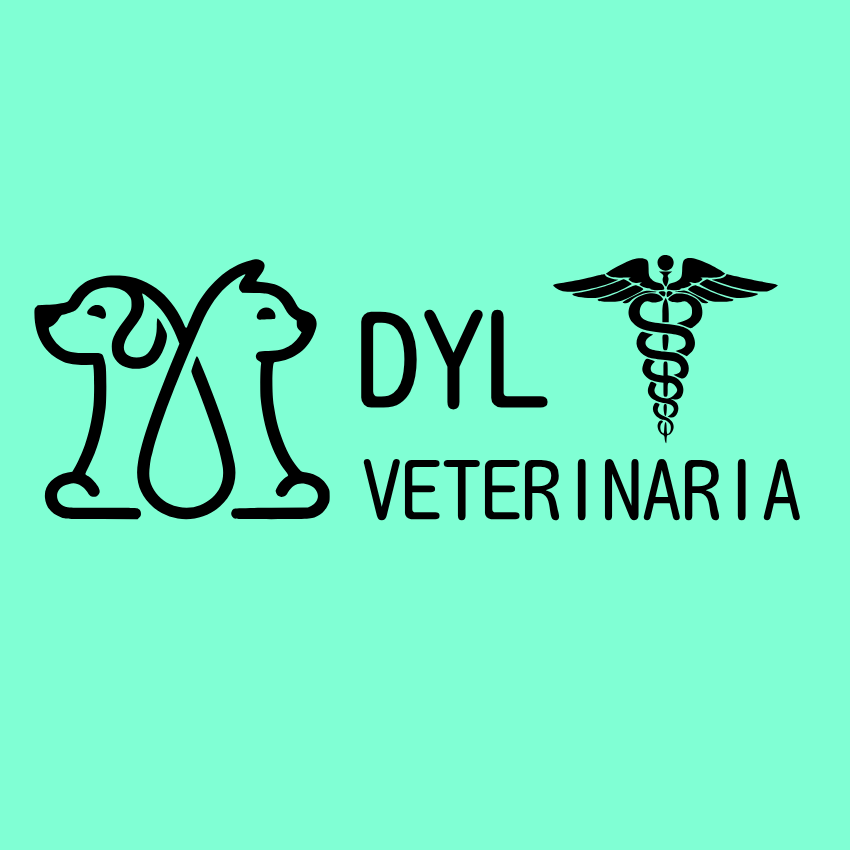

<p align="center">
  
</p>


# 📄 README - DYL Veterinaria

---

## 🐾 Proyecto: DYL Veterinaria

Sitio web desarrollado para brindar información y servicios relacionados con veterinaria.  
Construido con **React** y **Bootstrap** para un diseño responsivo y funcional.

---

## 🚀 Tecnologías usadas

-   **React** — Biblioteca JavaScript para construir interfaces de usuario.
-   **Bootstrap** — Framework CSS para estilos responsivos y componentes UI.
-   **Vercel** — Plataforma para desplegar la aplicación con hosting rápido y escalable.

---

## 🎯 Características principales

-   Diseño responsivo para dispositivos móviles y escritorio.
-   Navegación intuitiva con React Router (si aplica).
-   Componentes estilizados usando Bootstrap para rapidez y consistencia visual.
-   Sitemap.xml generado y disponible para SEO y motores de búsqueda.
-   Fácil ampliación y mantenimiento gracias a estructura modular React.

---

## 🛠️ Instalación y configuración local

### Prerrequisitos

-   Node.js (v14+ recomendada)
-   npm o yarn

### Pasos para ejecutar localmente

1. Clona el repositorio:
    ```bash
    git clone https://github.com/tu-usuario/dyl-veterinaria.git # Reemplaza con tu usuario
    cd dyl-veterinaria
    ```
2. Instala las dependencias:
    ```bash
    npm install
    # o si usas yarn:
    # yarn install
    ```
3. Ejecuta la app en modo desarrollo:
    ```bash
    npm start
    # o si usas yarn:
    # yarn start
    ```
4. Abre `http://localhost:3000` en tu navegador para ver la aplicación.

---

## 📦 Estructura del proyecto

```plaintext
dyl-veterinaria/
├── public/
│   ├── index.html
│   ├── sitemap.xml
│   └── favicon.ico
├── src/
│   ├── components/      # Componentes reutilizables de React
│   ├── pages/           # Páginas principales de la aplicación
│   ├── App.js           # Componente raíz
│   └── index.js         # Punto de entrada de React
└── README.md
```


## 🖌️ Uso de Bootstrap

Bootstrap se integra importando sus estilos directamente en `src/index.js` o `src/App.js`:
```javascript
import 'bootstrap/dist/css/bootstrap.min.css';
```
Se utilizan las clases de Bootstrap (`className="container"`, `className="btn btn-primary"`, etc.) directamente en los componentes de React para aplicar los estilos.

---

## 📈 SEO y sitemap

Se ha generado un `sitemap.xml` y está disponible en la raíz del sitio desplegado para ayudar a los motores de búsqueda a indexar el contenido de manera eficiente. Puedes verlo en:
`https://dyl-veterinaria-6xvc.vercel.app/sitemap.xml`

---

## ☁️ Despliegue

El proyecto está desplegado en Vercel.

Deploy automático mediante push a rama principal (main/master).

---

🤝 Contribuciones

Se aceptan Pull Requests para mejoras y correcciones.

Abre un issue para sugerencias o reportar bugs.

---

📄 Licencia

MIT License © 2024 DYL Veterinaria